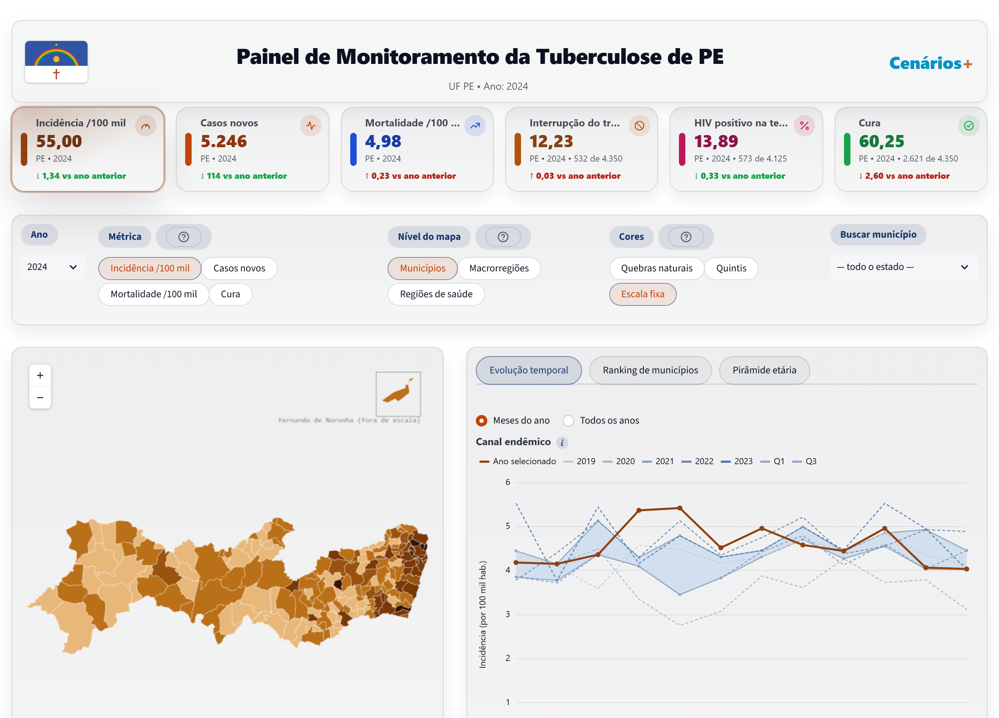
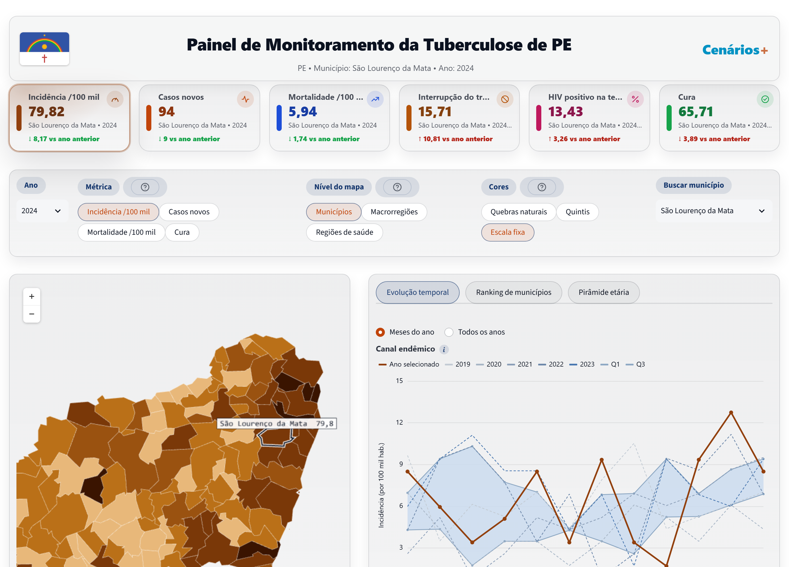
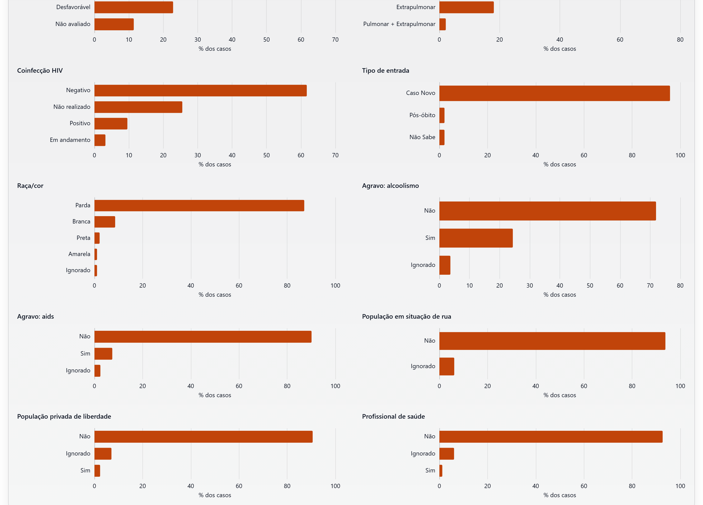

# Painel de Monitoramento da Tuberculose — Pernambuco

[](https://github.com/Mcardosor/Tuberculose_Pernambuco/actions/workflows/ci.yml)


Painel de vigilância epidemiológica da tuberculose no estado de Pernambuco,
com recorte por **município**, **região de saúde** e **macrorregião de
saúde**, para a Secretaria Estadual de Saúde e para as equipes de vigilância
dos municípios.

**No ar:** <https://painel.cenarios.unb.br/cenarios/tbpe/>



## Sumário

- [Visão geral](#visão-geral)
- [O que o painel mostra](#o-que-o-painel-mostra)
- [Como os números são calculados](#como-os-números-são-calculados)
- [Arquitetura](#arquitetura)
- [Dados](#dados)
- [Instalação e execução](#instalação-e-execução)
- [Testes](#testes)
- [Deploy](#deploy)
- [Estrutura do repositório](#estrutura-do-repositório)
- [Manutenção](#manutenção)
- [Família Cenários+](#família-cenários)
- [Fontes e créditos](#fontes-e-créditos)

## Visão geral

O painel responde, para qualquer território de Pernambuco e qualquer ano
desde 2010, às perguntas que a vigilância da tuberculose faz primeiro: qual
a incidência, quantos casos novos, quantos morrem, quantos interrompem o
tratamento, quantos são coinfectados pelo HIV e quantos se curam — e como
isso se distribui no mapa, no tempo, por idade e por perfil clínico e social.

É a versão estadual do painel de monitoramento da tuberculose do Recife
desenvolvido pela equipe parceira em R/Shiny. Mantém a mesma organização de
tela e a mesma linguagem visual; os números seguem as definições do Boletim
Epidemiológico de Tuberculose do Ministério da Saúde. Onde as duas coisas
divergem, a divergência está escrita — em [`docs/metodologia.md`](docs/metodologia.md)
e no tooltip do próprio indicador.

## O que o painel mostra

| Bloco | Conteúdo |
|---|---|
| **Indicadores** | Seis cards do ano e território selecionados, com a variação contra o ano anterior e, nas proporções, a fração de onde saem (ex.: "2.621 de 4.350"): incidência, casos novos, mortalidade, interrupção de tratamento, HIV positivo na testagem e proporção de cura. |
| **Mapa** | Coroplético clicável por município, região de saúde ou macrorregião, com três classificações de cor: quebras naturais, quintis e uma **escala fixa** ancorada no Brasil (40 por 100 mil), em Pernambuco (55) e na meta de cura de 85 % da OMS — a única que deixa dois anos comparáveis. Legenda com o nome e o N de cada classe. |
| **Evolução temporal** | Canal endêmico (ano selecionado sobre a faixa interquartil dos cinco anteriores), série anual e epicurva mensal desde 2010. |
| **Ranking** | Os territórios do recorte ordenados pela métrica do mapa, nas cores do mapa; clicar numa barra destaca o município ou abre a região. |
| **Pirâmide etária** | Casos por sexo e faixa etária, em contagem ou por 100 mil habitantes da faixa. |
| **Tópicos de interesse** | Distribuição de 22 variáveis da ficha do SINAN (desfecho, forma clínica, HIV, raça/cor, agravos, populações específicas…), dez abertas de saída. |

**Tudo segue o clique.** Entrar numa macrorregião, numa região de saúde ou
num município recalcula os seis indicadores e todos os gráficos para aquele
território — somando os municípios e recalculando as taxas, nunca tirando
média de taxas. E tudo **transiciona**: a câmera do mapa voa para o recorte
novo, as cores dos polígonos interpolam e cada barra e linha desliza para o
valor novo em vez de ser redesenhada.





## Como os números são calculados

| Indicador | Numerador | Denominador |
|---|---|---|
| Incidência (por 100 mil) | casos novos por município de residência | população estimada (IBGE) |
| Casos novos | casos novos por município de residência | — |
| Mortalidade (por 100 mil) | óbitos com tuberculose como causa básica (SIM) | população estimada |
| Interrupção de tratamento (%) | abandono (`SITUA_ENCE = 2`) | todos os encerramentos |
| HIV positivo na testagem (%) | positivos | positivos + negativos (testados) |
| Proporção de cura (%) | cura (`SITUA_ENCE = 1`) | todos os encerramentos |

Regras que valem em todo o painel: recorte por **residência**; regiões
calculadas da **soma** dos municípios; percentual suprimido abaixo de cinco
registros; o SIM fecha um ano depois do SINAN, então o ano corrente não tem
mortalidade; ano parcial é **detectado** pelos meses com dado, não presumido.

A definição completa de cada número, as âncoras da escala fixa e o que fica
de fora por não haver microdado: [`docs/metodologia.md`](docs/metodologia.md).
O que a extração traz e onde diverge do Ministério da Saúde:
[`docs/contrato-dados.md`](docs/contrato-dados.md).

## Arquitetura

```
app.py                      composição da tela (página única)
 └─ src/estado.py           navegação: PE → macrorregião → região de saúde → município
     └─ src/data/           escopo, leitores DuckDB sobre parquet, KPIs, canal, recortes, geometria
         ├─ src/mapa.py + src/mapa_componente.py       mapa (pydeck → deck.gl vivo)
         └─ src/grafico_componente.py                 gráficos (opções ECharts vivas)
src/doencas/tuberculose.py  o "disease pack": KPIs, cortes, variáveis, rótulos, cores
src/theme/                  tokens, cores e componentes HTML/CSS da identidade visual
```

- **Core único, doença como configuração.** Mapa, gráficos, navegação e
  leitores não sabem que doença desenham; tudo que é específico da
  tuberculose vive no pack.
- **Componentes próprios para mapa e gráficos.** O Streamlit redesenha a
  tela a cada interação, o que não permite transição. Aqui o mapa (deck.gl)
  e os gráficos (ECharts) são iframes com a instância viva entre execuções,
  recebendo só os dados novos. Os bundles vão vendorados — o painel não
  depende de CDN. A história de como se chegou a isso, o que foi tentado
  antes e a receita para outros painéis: [`docs/mapa-clique.md`](docs/mapa-clique.md).
- **Resiliência por painel.** Cada bloco da tela é isolado: uma falha num
  gráfico vira um aviso naquele bloco, não uma página em branco.

## Dados

A extração **agregada** do SINAN e do SIM produzida pela equipe parceira — a
mesma que serve o painel nacional — em parquet com particionamento Hive:
`incidence`, `incidence_0_14`, `sinan_landing`, `_cache_ts`,
`cache_ts_sim_obitos` e `piramides`. Mais as malhas municipais e a
hierarquia de regiões de saúde da SES-PE em `data/support/`.

- **Nenhum dado nominal entra no projeto.** Só agregados por município.
- Os parquets **não são versionados**. Em desenvolvimento, `data/` é uma
  junção para a pasta do painel nacional (`../sinan/data`); em produção, um
  volume. `SINAN_DATA_DIR` aponta para outro lugar quando preciso.
- Cobertura: 2010 a 2025 (2025 parcial). O painel abre no último ano
  fechado.

## Instalação e execução

Requisitos: Python 3.13 e a extração de dados (ver acima).

```bash
git clone https://github.com/Mcardosor/Tuberculose_Pernambuco.git tbpe
cd tbpe
python -m venv .venv && .venv/Scripts/activate        # Linux/macOS: source .venv/bin/activate
pip install -r requirements.lock.txt
export SINAN_DATA_DIR=/caminho/para/data              # ou a junção data -> ../sinan/data
streamlit run app.py
```

O painel abre em <http://localhost:8501>. Na família Cenários+ os painéis
compartilham o ambiente do painel nacional (`../sinan/.venv`); o
[`CLAUDE.md`](CLAUDE.md) descreve esse arranjo e o que quem for mexer no
código precisa saber.

## Testes

```bash
pytest                                   # ~390 testes com os dados (~60 s)
ruff check --select F app.py src tests   # nome indefinido, import quebrado, código morto
```

Sem os dados, `pytest` roda só o que não depende deles — tema, navegação,
componentes, montagem das opções ECharts — e diz o que pulou. É o que o CI
faz a cada push, junto com a construção da imagem Docker.

A suíte cobre, entre outras coisas: as fórmulas de cada indicador contra
valores conferidos à mão; a soma regional batendo com o card da região; a
legenda da escala fixa; o clique no mapa e no ranking; a tela inteira por
`AppTest`, em todos os níveis de navegação.

## Deploy

A imagem é `python:3.13-slim` com o Streamlit sob `/cenarios/tbpe`; os
dados entram por volume. Na VM do projeto:

```bash
ssh cenarios-vm 'cd ~/tbpe && git pull && docker compose up -d --build'
```

Portas, caminho no nginx, como voltar à versão anterior e o número a
conferir depois de todo deploy: [`docs/deploy.md`](docs/deploy.md).

## Estrutura do repositório

```
tbpe/
├── app.py                        composição da tela
├── src/
│   ├── estado.py                 navegação PE → macro → região → município
│   ├── mapa.py                   camadas, escalas de cor, legenda (pydeck)
│   ├── mapa_componente.py        o mapa como componente vivo
│   ├── componente_mapa/          deck.gl vendorado + protocolo do Streamlit
│   ├── grafico_componente.py     os gráficos como opções ECharts
│   ├── componente_grafico/       ECharts vendorado + protocolo do Streamlit
│   ├── resiliencia.py            isolamento de falha por bloco da tela
│   ├── data/                     escopo, leitura, kpis, canal, recortes, geo
│   ├── doencas/tuberculose.py    o pack da doença
│   └── theme/                    identidade visual
├── tests/                        suíte pytest
├── scripts/                      geometria, versão dos scripts, capturas
├── docs/                         metodologia, contrato de dados, deploy, componentes
├── assets/                       bandeira de PE e marca
├── .github/workflows/ci.yml      CI
├── Dockerfile · docker-compose.yml
└── requirements.txt · requirements.lock.txt
```

## Manutenção

- **Nova extração de dados:** trocar o conteúdo de `data/` (ou do volume) e
  reiniciar; nada no código depende do ano.
- **Mudou `mapa.js` ou `grafico.js`:** rodar `python -m scripts.versionar_js`.
  O Streamlit serve `.js` de componente com cache, e o carimbo `?v=<hash>`
  é o que faz o navegador baixar o arquivo novo (o teste cobra).
- **Capturas do README:** `python -m scripts.capturar_telas` com o servidor
  de dev no ar (usa Playwright, que não é dependência do painel).
- **Nova UF ou doença:** a receita da família está em
  [`docs/como-fazer.md`](docs/como-fazer.md).

## Família Cenários+

Este painel é um de três construídos sobre o mesmo core e a mesma
identidade, e as melhorias circulam entre eles:

| Painel | Recorte | Repositório |
|---|---|---|
| Tuberculose — Pernambuco (este) | estado, por município e região de saúde | [Mcardosor/Tuberculose_Pernambuco](https://github.com/Mcardosor/Tuberculose_Pernambuco) |
| Hanseníase — Pernambuco | estado, por município e região de saúde | [Mcardosor/hansepe](https://github.com/Mcardosor/hansepe) (privado) |
| Tuberculose — Recife | cidade, por bairro e distrito sanitário | [Mcardosor/recifetb](https://github.com/Mcardosor/recifetb) (privado) |

## Fontes e créditos

- **Dados:** SINAN e SIM — Ministério da Saúde; população — IBGE; hierarquia
  de regiões e macrorregiões de saúde — Secretaria Estadual de Saúde de
  Pernambuco. Dados preliminares, sujeitos a alteração: o SINAN é atualizado
  retroativamente.
- **Origem:** painel de monitoramento da tuberculose do Recife, em R/Shiny,
  da equipe parceira do projeto Cenários+ (UnB).
- **Desenvolvimento:** projeto Cenários+ — Universidade de Brasília.
